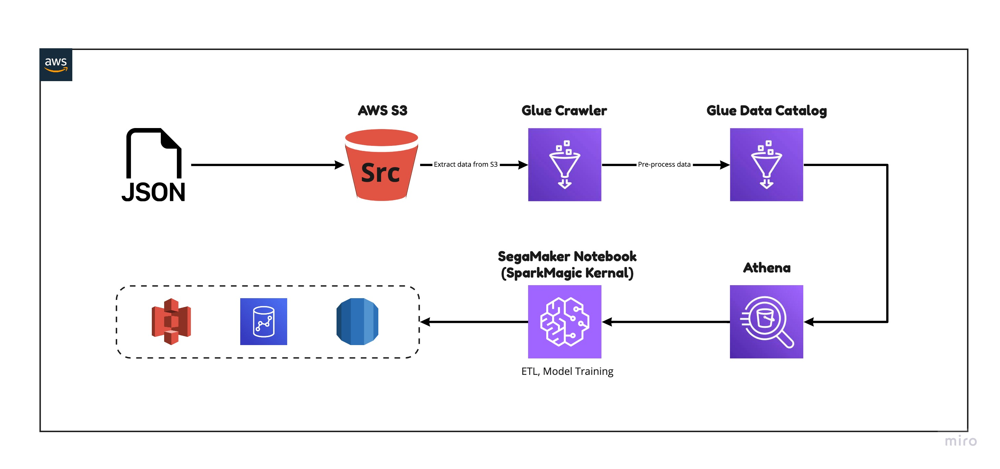

# Develop ETL scripts using a SageMaker Notebook in AWS Glue
AWS Glue can create an environment—known as a development endpoint—that you can use to iteratively develop and test your extract, transform, and load (ETL) scripts. 



# Data Source
sample data 
```
s3://awsglue-datasets/examples/us-legislators 
```
sample script
``` 
https://github.com/aws-samples/aws-glue-samples/blob/master/examples/join_and_relationalize.md 
```

# Preparation
1. Build Dev endpoints with IAM Role ( attach adminaccess)

2. Create a SageMaker Notebook with the Development Endpoint and IAM Role
create notebook 

3. Create a S3 bucket for source file 

4. Create a glue crawler with S3 source bucket path